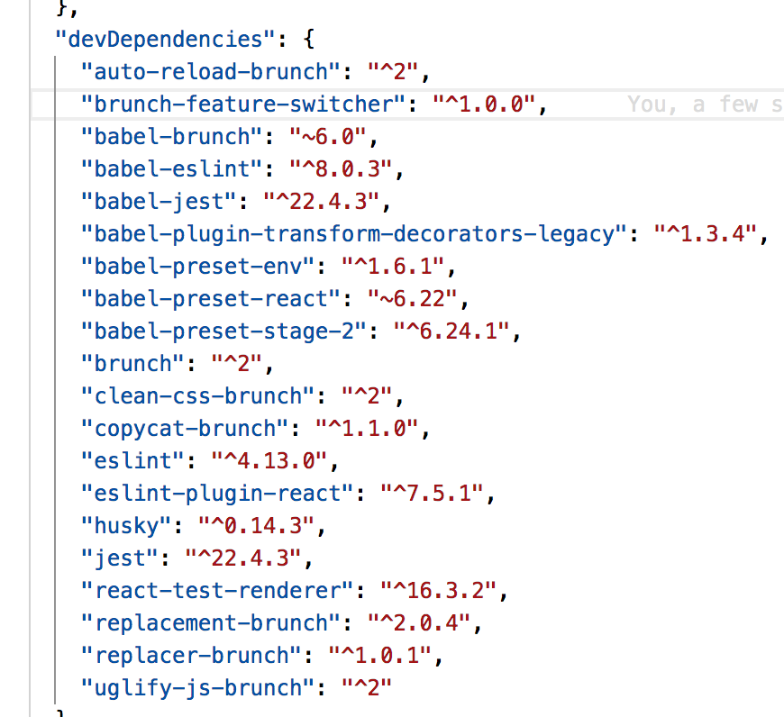

# Plugin that hepls to add/remove/replace code based on included features

__How to install:__
- `yarn install brunch-feature-switcher`
- `npm i brunch-feature-switcher`

---
__Example:__
```javascript
// #brunch-config.js
module.exports = {
  plugins: {
    featureSwitcher: {
      features: {
        // set feature on
        billing: false,
        // Retrieve from env vars
        stat: process.env.FEATURE_STAT === 'true',
      },
    },
  },
}

// #some.code.js

/* @feature billing:off:remove */
import billingUtils from './billingUtils'
import someOtherStuff from './someOtherStuff'

/* @feature billing:off:remove */
const BILLING_IS_OK = 'status_billing_is_ok'

/* @feature billing:on:remove */
const billingFaker = () => { /* ... */ };

class Checker {
  constructor(...) {
    ...somecode
  }

  get billingKeys() {
    /* @feature billing:off:inl_replace:/return []/ */
    return self.keys.filter(({ billing }) => billing)
  }

  get devKeys() {
    return self.keys.filter(({ dev }) => dev)
  }

  get allKeys() {
    return [...this.devKeys, ...this.billingKeys]
  }
}

```

It produces the following code after `brunch build` if billing feature is __off__


__Example: Result after build__
```javascript
import someOtherStuff from './someOtherStuff'

const billingFaker = () => { /* ... */ };

class Checker {
  constructor(...) {
    ...somecode
  }

  get billingKeys() {
    return []
  }

  get devKeys() {
    return self.keys.filter(({ dev }) => dev)
  }

  get allKeys() {
    return [...this.devKeys, ...this.billingKeys]
  }
}
```

It produces the following code after `brunch build` if billing feature is __on__.

```javascript
import billingUtils from './billingUtils'
import someOtherStuff from './someOtherStuff'

const BILLING_IS_OK = 'status_billing_is_ok'

class Checker {
  constructor(...) {
    ...somecode
  }

  get billingKeys() {
    return self.keys.filter(({ billing }) => billing)
  }

  get devKeys() {
    return self.keys.filter(({ dev }) => dev)
  }

  get allKeys() {
    return [...this.devKeys, ...this.billingKeys]
  }
}

```

---

__Short explanation:__

This pluging add some sort of pre-build directives that help you to remove code blocks/expressions/ and other code stuff based on state of features.

To mark some block for handling you should use a comment with defined format:
- `/* @feature _name_:_state_:_applied_action_:_args_ */`
- `// @feature _name_:_state_:_applied_action_:_args_`

Example:
```javascript

const dropdownItems = [
  /* @feature billing:off:remove */
  {
    title: 'Hello',
  },
  /* @feature billing:on:remove */
  {
    title: 'World',
  }
]

/* @feature billing:off:inl_replace:/throw new Error('error')/ */
const a = [1]
```

You can read this pre-build directive as:
- ___if billing feature is off, then remove `{title: 'Hello'}`___
- ___if billing feature is on, then remove `{title: 'World'}`___
- ___if billing feature is off, then replace `const a = [1]` with `throw new Error('error')`___

---

__Important!__

You should move `brunch-feature-switcher` up in package.json (to make it stand before all other code transformation (es6 to es5 transformation for instance))





---
__TODO:__
- Going to add complex replacment procedure
- Add docs and more examples
